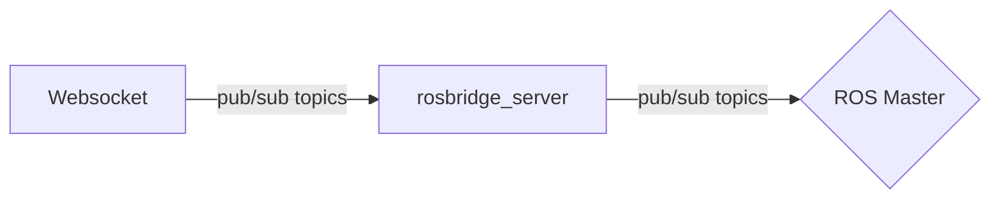

# ROS Robot UI

## Usage

1. Source ROS.
`source /opt/ros/$ROS_DISTRO/source.bash`

2. Clone this repo to your catkin workspace.
`git clone https://github.com/erdemuysalx/robot_ui`

4.  Source your catkin workspace.
`source ~/catkin_ws/devel/setup.bash`

5. Launch rosbridge websocket
    `roslaunch robot_ui websocket.launch`

## Flow Chart

